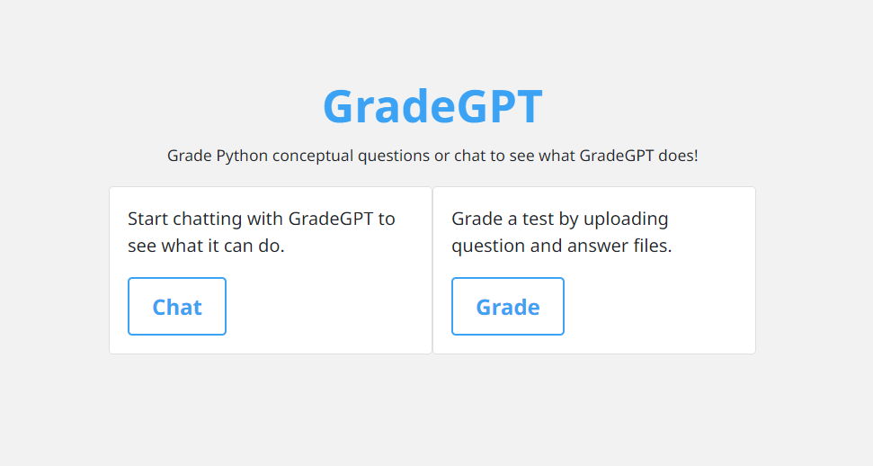
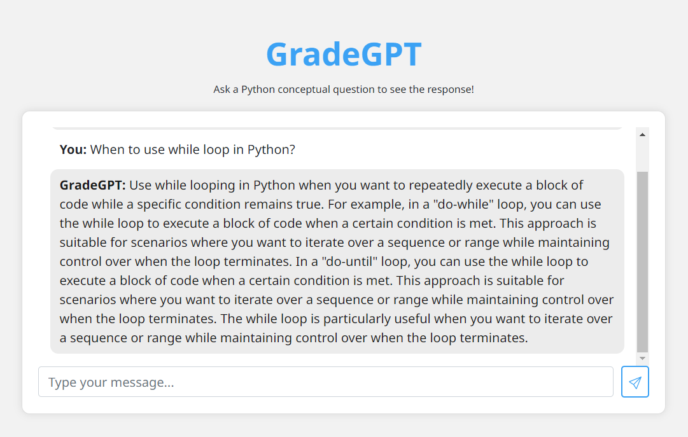
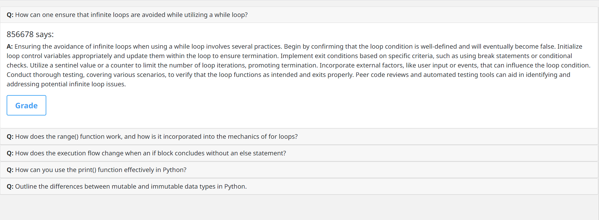
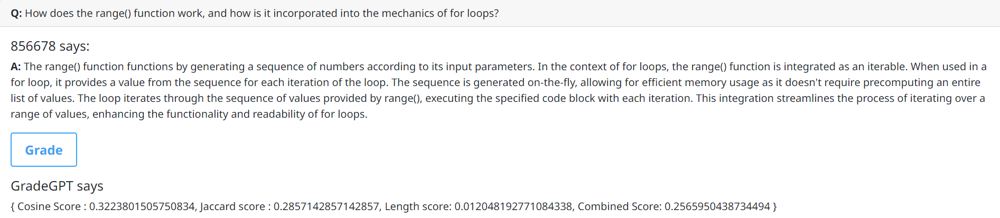

# GradeGPT
## Project Setup
1. Setup project
    Copy the contents of this repo to the desired folder
2. From the root folder, run the following command to create a sqlite database
    ```python3 db.py```
    This will generate a file gradegpt.db in the root directory, this will act as the database
3. Run Flask app
    ```flask --app app run```
4. To grade the questions, go to http://127.0.0.1:{your_port}/upload
5. Select 'questions.docs' and then 'answers.docs' file, and click upload
6. This will save the question and answers to the db
7. You can expand each question and click on 'Grade' to start grading the answers, this will cause the GPT-2 to generate it's answer and will return the scores

## Demo Images
1. Home page


2. Chat


3. Uploaded questions and answers


4. Grading results

